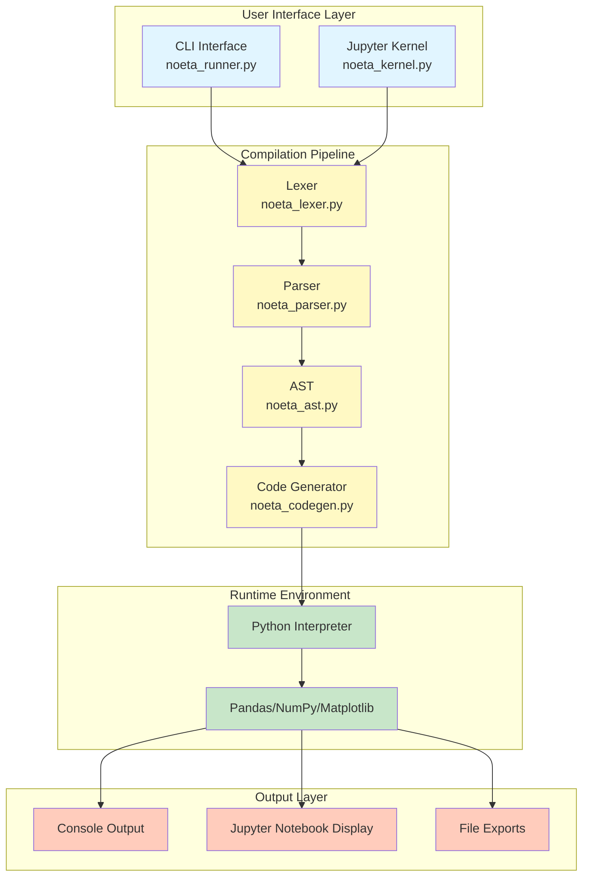
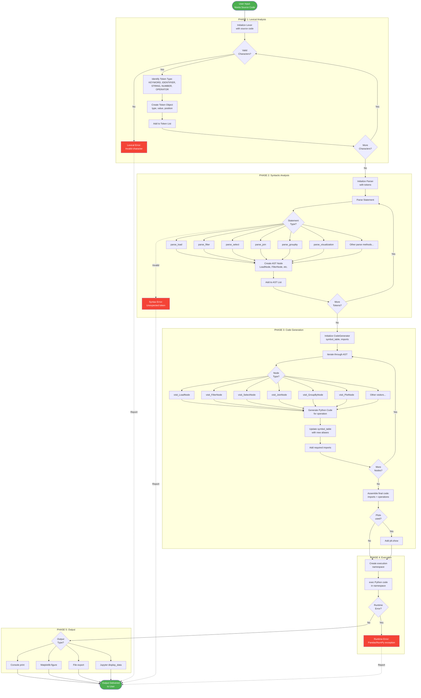
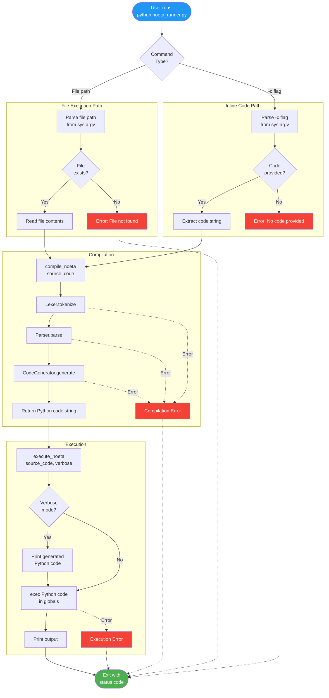
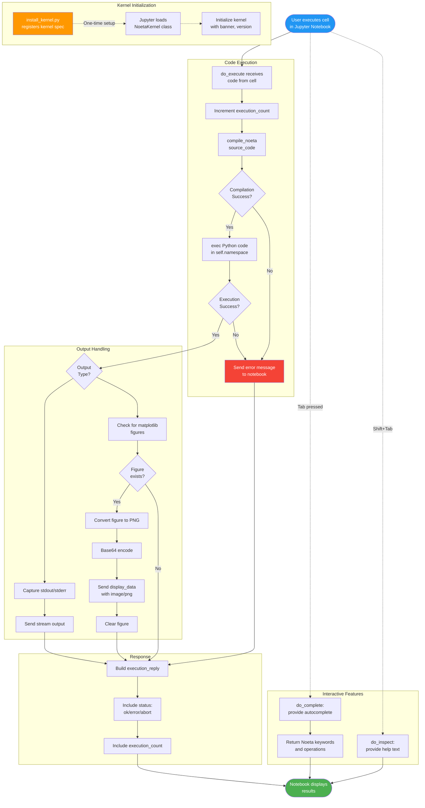
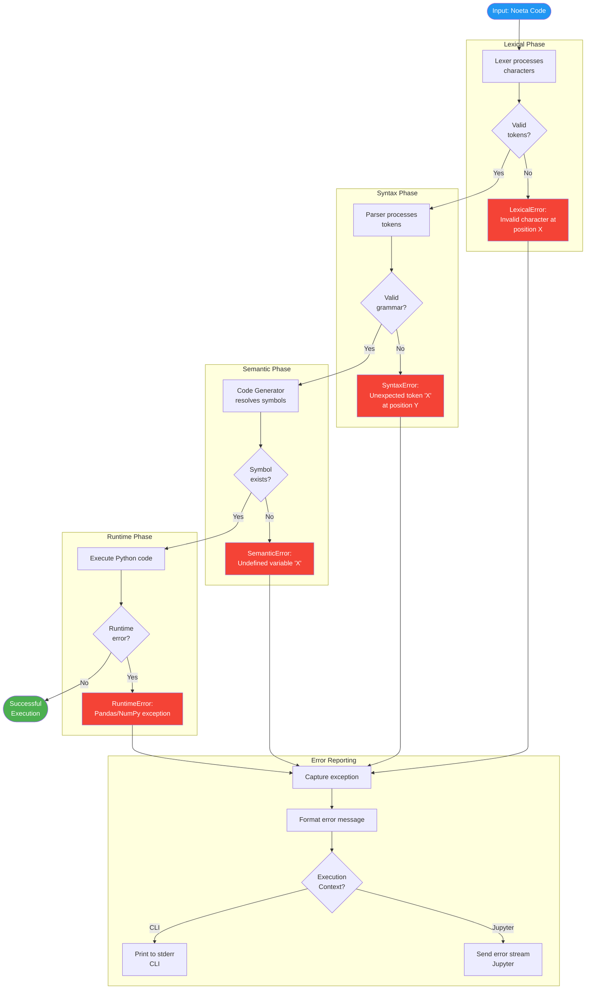
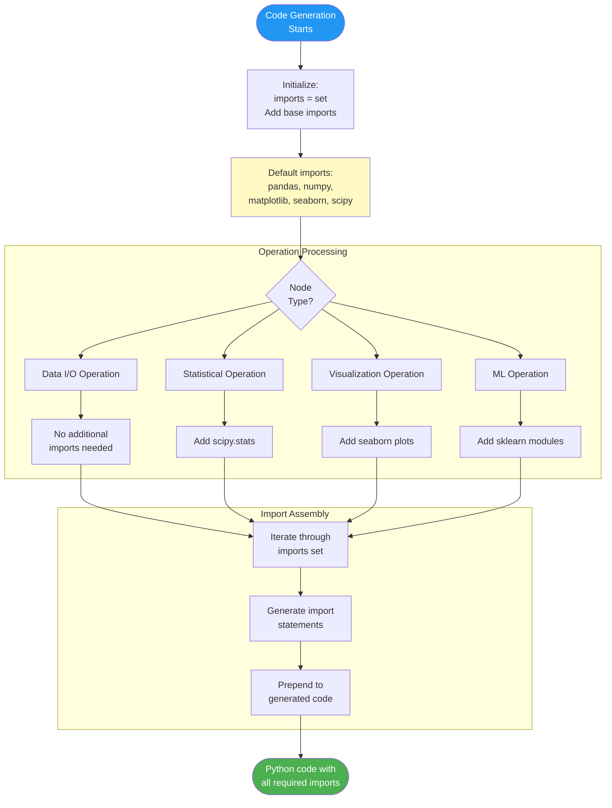
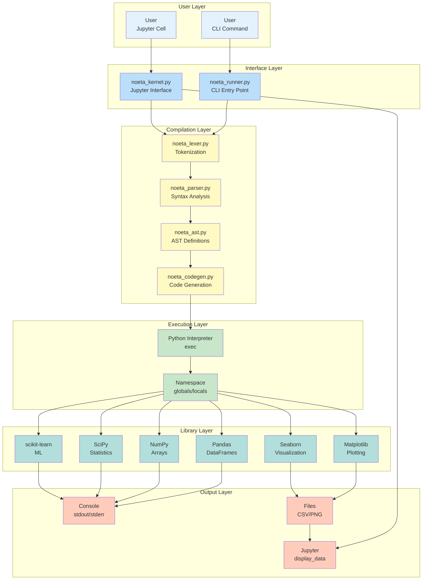

# Noeta DSL - Complete System Flow Diagram

**Last Updated**: December 15, 2025

## 1. High-Level System Architecture



---

## 2. Detailed Compilation Pipeline Flow



---

## 3. CLI Execution Flow



---

## 4. Jupyter Kernel Flow



---

## 5. Symbol Table Management Flow

```mermaid
flowchart LR
    subgraph "Operation 1: LOAD"
        L1[load data.csv as df1]
        L2[visit_LoadNode]
        L3[Generate:<br/>df1 = pd.read_csv]
        L4[symbol_table:<br/>df1 -> df1]
    end

    subgraph "Operation 2: FILTER"
        F1[filter df1<br/>where age > 25 as df2]
        F2[visit_FilterNode]
        F3[Resolve df1<br/>from symbol_table]
        F4[Generate:<br/>df2 = df1[df1.age > 25]]
        F5[symbol_table:<br/>df1 -> df1<br/>df2 -> df2]
    end

    subgraph "Operation 3: SELECT"
        S1[select name, age<br/>from df2 as df3]
        S2[visit_SelectNode]
        S3[Resolve df2<br/>from symbol_table]
        S4[Generate:<br/>df3 = df2[[name, age]]]
        S5[symbol_table:<br/>df1 -> df1<br/>df2 -> df2<br/>df3 -> df3]
    end

    L1 --> L2 --> L3 --> L4
    L4 --> F1
    F1 --> F2 --> F3 --> F4 --> F5
    F5 --> S1
    S1 --> S2 --> S3 --> S4 --> S5

    style L4 fill:#fff9c4
    style F5 fill:#fff9c4
    style S5 fill:#fff9c4
```

---

## 6. Operation Category Flow

```mermaid
graph TD
    START([Noeta Operation])

    subgraph "Data I/O"
        IO1[LOAD:<br/>CSV -> DataFrame]
        IO2[SAVE:<br/>DataFrame -> CSV]
    end

    subgraph "Transformation"
        T1[SELECT:<br/>Column projection]
        T2[FILTER:<br/>Row filtering]
        T3[SORT:<br/>Ordering]
        T4[MUTATE:<br/>Column creation]
        T5[APPLY:<br/>Lambda functions]
    end

    subgraph "Aggregation"
        A1[GROUPBY:<br/>Group + aggregate]
        A2[SAMPLE:<br/>Random sampling]
    end

    subgraph "Cleaning"
        C1[DROPNA:<br/>Remove nulls]
        C2[FILLNA:<br/>Impute values]
    end

    subgraph "Joining"
        J1[JOIN:<br/>Merge DataFrames]
    end

    subgraph "Analysis"
        AN1[DESCRIBE:<br/>Statistics]
        AN2[SUMMARY:<br/>DataFrame info]
        AN3[OUTLIERS:<br/>IQR detection]
        AN4[QUANTILE:<br/>Percentiles]
        AN5[NORMALIZE:<br/>Min-max scaling]
        AN6[BINNING:<br/>Discretization]
        AN7[ROLLING:<br/>Window functions]
        AN8[HYPOTHESIS:<br/>T-test]
    end

    subgraph "Visualization"
        V1[BOXPLOT]
        V2[HEATMAP]
        V3[PAIRPLOT]
        V4[TIMESERIES]
        V5[PIE]
        V6[EXPORT_PLOT]
    end

    END([Generated<br/>Python/Pandas Code])

    START --> IO1 & IO2
    START --> T1 & T2 & T3 & T4 & T5
    START --> A1 & A2
    START --> C1 & C2
    START --> J1
    START --> AN1 & AN2 & AN3 & AN4 & AN5 & AN6 & AN7 & AN8
    START --> V1 & V2 & V3 & V4 & V5 & V6

    IO1 & IO2 --> END
    T1 & T2 & T3 & T4 & T5 --> END
    A1 & A2 --> END
    C1 & C2 --> END
    J1 --> END
    AN1 & AN2 & AN3 & AN4 & AN5 & AN6 & AN7 & AN8 --> END
    V1 & V2 & V3 & V4 & V5 & V6 --> END

    style START fill:#2196f3,color:#fff
    style END fill:#4caf50,color:#fff
```



---

## 7. Error Handling Flow



---

## 8. Import Management Flow



---

## 9. Complete End-to-End Example Flow

```mermaid
flowchart TD
    START([User writes Noeta code:<br/>load sales.csv as sales<br/>filter sales where revenue > 1000<br/>describe sales])

    subgraph "LEXER"
        LEX1[Token: LOAD]
        LEX2[Token: STRING sales.csv]
        LEX3[Token: AS]
        LEX4[Token: IDENTIFIER sales]
        LEX5[Token: FILTER]
        LEX6[Token: IDENTIFIER sales]
        LEX7[Token: WHERE]
        LEX8[Token: IDENTIFIER revenue]
        LEX9[Token: OPERATOR >]
        LEX10[Token: NUMBER 1000]
        LEX11[Token: DESCRIBE]
        LEX12[Token: IDENTIFIER sales]
    end

    subgraph "PARSER"
        PARSE1[LoadNode:<br/>file=sales.csv<br/>alias=sales]
        PARSE2[FilterNode:<br/>source=sales<br/>condition=revenue>1000<br/>alias=sales]
        PARSE3[DescribeNode:<br/>source=sales]
    end

    subgraph "CODE GENERATOR"
        GEN1[visit_LoadNode:<br/>sales = pd.read_csv<br/>symbol_table[sales] = sales]
        GEN2[visit_FilterNode:<br/>sales = sales[sales.revenue > 1000]<br/>symbol_table[sales] = sales]
        GEN3[visit_DescribeNode:<br/>print sales.describe]
    end

    PYTHON[Generated Python:<br/>import pandas as pd<br/>...<br/>sales = pd.read_csv 'sales.csv'<br/>sales = sales[sales['revenue'] > 1000]<br/>print sales.describe]

    EXEC[Execute Python code:<br/>Load CSV -> DataFrame<br/>Filter rows<br/>Print statistics]

    OUTPUT[Console Output:<br/>count  mean  std  min  25%  50%  75%  max<br/>...]

    END([User sees results])

    START --> LEX1
    LEX1 --> LEX2 --> LEX3 --> LEX4
    LEX4 --> LEX5 --> LEX6 --> LEX7
    LEX7 --> LEX8 --> LEX9 --> LEX10
    LEX10 --> LEX11 --> LEX12

    LEX12 --> PARSE1
    PARSE1 --> PARSE2
    PARSE2 --> PARSE3

    PARSE3 --> GEN1
    GEN1 --> GEN2
    GEN2 --> GEN3

    GEN3 --> PYTHON
    PYTHON --> EXEC
    EXEC --> OUTPUT
    OUTPUT --> END

    style START fill:#2196f3,color:#fff
    style END fill:#4caf50,color:#fff
    style PYTHON fill:#fff9c4
```

---

## 10. System Component Interaction Diagram



---

## Key Decision Points Summary

| Phase | Decision Point | Criteria | Outcome |
|-------|---------------|----------|---------|
| **Input** | Execution Mode | CLI flag (-c) or file path | File read vs. inline code |
| **Lexer** | Token Type | Character pattern matching | Token categorization |
| **Parser** | Statement Type | First keyword token | Appropriate parse_* method |
| **Code Gen** | Node Type | AST node class | Appropriate visit_* method |
| **Code Gen** | Plot Detection | Visualization node present | Add plt.show() or not |
| **Execution** | Runtime Error | Exception raised | Continue or abort |
| **Output** | Context Type | CLI vs. Jupyter | Console print vs. display_data |
| **Output** | Content Type | stdout vs. figure | Stream vs. image encoding |

---

## Notes for Stakeholders

1. **Modularity**: Each phase is independent and can be enhanced without affecting others
2. **Extensibility**: New operations require additions to all four compilation components
3. **Error Handling**: Multi-layer error detection with clear reporting
4. **Performance**: Direct Python code generation ensures near-native Pandas performance
5. **Interoperability**: Works seamlessly with existing Python data science ecosystem
6. **Debugging**: Verbose mode shows generated Python code for transparency
7. **User Experience**: Both CLI and notebook interfaces for different workflows
